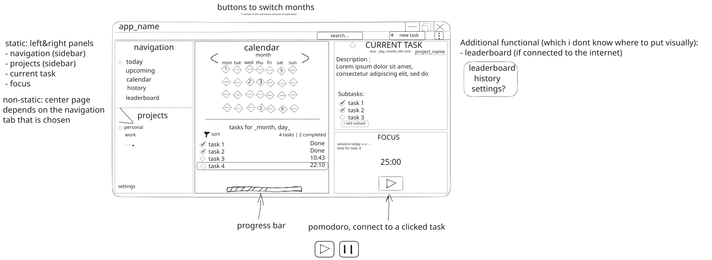

# 🗒️Overview

Basic to-do app with timer and project functionality. Cross-platform & good-looking.

App is developed as a pet project which initially started because I like the pomodoro timer and task scheduling, however I couldn't find a convenient solution in one place[^1], so I decided to create my own.

## 🛠️ Building and installing

### 📄Release pages

Coming soon...

### ⚒️ From source

I've created a simple bash script for development purposes, which you can use to build the project from source.

For example:

```bash
./build.sh --install=my_dir # build & install release to <my_dir>
./build.sh --run # build & run debug version
```

For those who trust CMake more than me (understandable 🙈):

```bash
cmake -S . -B build
cmake --build build --parallel
cmake --install build # system installation
```

> Run `cmake --install build --prefix path/to/directory` if you want it installed locally

# ✨Features

- Create projects and tasks related to them
- Adding subtasks if wanted
- Calendar
- Pomodoro timer connected to the current task
- History of previous days and tasks
  - Searching with filters

## 💡When I figure out basic functionality

Then it would be cool to find out a way to safely store user's data so that they can use an app on different devices. Maybe a cloud or something.

Possible additions after saving data to a server are:

- Store & sync user's data between devices
- Leader board with a number of tasks/projects and time spent on them.

# ✏️Draft look:


[^1]: I used obsidian for tasks with a special plugin, and a free version of the pomodoro timer on my browser, which was quite uncomfortable since I couldn't track the tasks inside the pomodoro. I also didn't like the fact that I always had to have an internet connection, which restricted me in usage and created bugs whenever I toggled my vpn on or off (the timer reset and I had to reload the web page, etc.)
